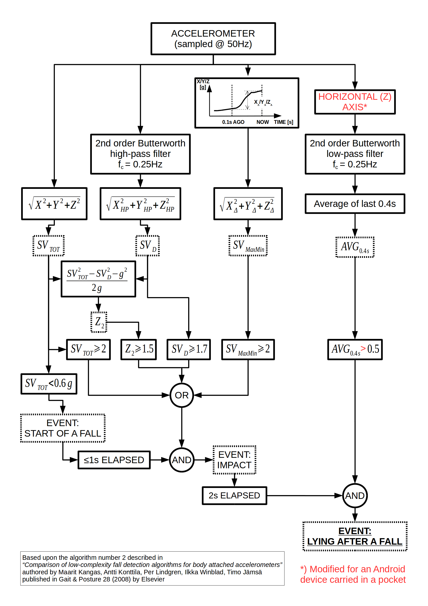

# Aplicación Experimental de Detección de Caídas para Android

## INTRODUCCIÓN

Cuando se detecta una caída, la aplicación enviará un SMS al número de emergencia configurado.

## GUÍA DEL USUARIO

* Asegúrate de configurar el número de teléfono de emergencia para que la aplicación llame automáticamente cuando se detecte una caída.
* Las llamadas de ese número serán contestadas automáticamente.
* Un SMS de ese número con la palabra POSICIÓN en el contenido será respondido automáticamente con la posición geográfica (si está disponible).
* Si el SMS contiene la palabra ALARMA, en su lugar, reproducirá un sonido de alarma.
* La aplicación se iniciará automáticamente cuando el teléfono se encienda.
* Para un rendimiento óptimo (para reducir el número de falsas alarmas y el número de caídas no detectadas), lleva el dispositivo cerca de tu cintura (un bolsillo del pantalón, un clip para el cinturón, etc.).
* Mantén tu dispositivo cargado en todo momento.

## CRÉDITOS

La detección de caídas se basa en el algoritmo número 2 descrito en
*"Comparison of low-complexity fall detection algorithms for body attached accelerometers"*
autores: Maarit Kangas, Antti Konttila, Per Lindgren, Ilkka Winblad, Timo Jamsa
y publicado en Gait & Posture 28 (2008) por Elsevier (busca el artículo [aquí](https://scholar.google.nl/scholar?hl=en&q=Comparison+of+low-complexity+fall+detection+algorithms+for+body+attached+accelerometers+Kangas+Konttila+Lindgren+Winblad+Jamsa))

